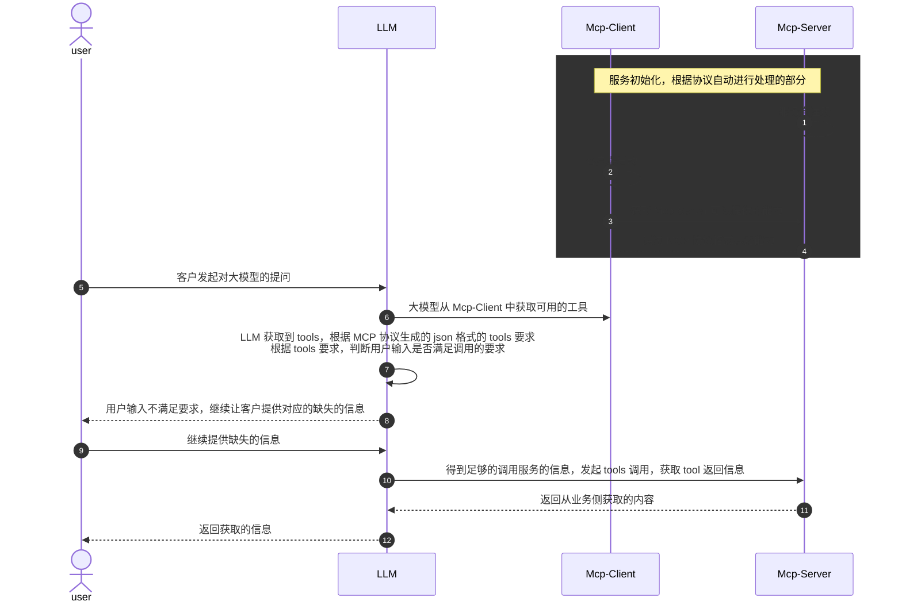

1. mcp 客户端和服务的交互说明

```mermaid
sequenceDiagram
    autonumber
    actor user
    participant LLM
    participant Mcp-Client
participant Mcp-Server

rect rgb(50, 50, 50)
note over Mcp-Server, Mcp-Client: 服务初始化，根据协议自动进行处理的部分
Mcp-Server ->> Mcp-Server: 服务自注册
Mcp-Client ->> Mcp-Client: 客户端启动
Mcp-Client ->> Mcp-Server: 获取 Mcp-Server 可以提供的能力
Mcp-Server -->> Mcp-Client:  通过 MCP 协议格式暴露能力
end

user ->> LLM: 客户发起对大模型的提问
LLM ->> Mcp-Client: 大模型从 Mcp-Client 中获取可用的工具
LLM ->> LLM: LLM 获取到 tools，根据 MCP 协议生成的 json 格式的 tools 要求 <br/> 根据 tools 要求，判断用户输入是否满足调用的要求 <br/>

LLM -->> user: 用户输入不满足要求，继续让客户提供对应的缺失的信息
user ->> LLM: 继续提供缺失的信息
LLM ->> Mcp-Server: 得到足够的调用服务的信息，发起 tools 调用，获取 tool 返回信息
Mcp-Server -->> LLM: 返回从业务侧获取的内容

LLM -->> user: 返回获取的信息
```